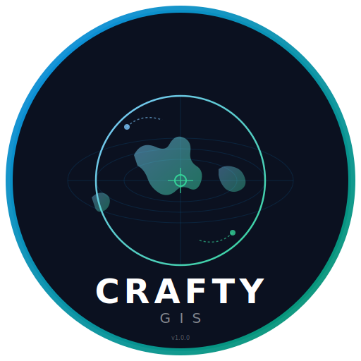

<div align="center">
  
  
  # 🌍 CRAFTY GIS
  
  **C**onversational **R**emote **A**nalysis & **F**ield **T**echnology for **G**eographic **I**nformation **S**ystems
  
  ### *AI-Powered Geospatial Intelligence Platform*
  
  [](LICENSE)
  [](https://www.python.org/)
  [](https://nextjs.org/)
  [](https://fastapi.tiangolo.com/)
  [](CONTRIBUTING.md)
  [](https://github.com/virahitvin8/crafty-gis)
  
  <br/>
  
  **You describe the problem. CRAFTY GIS solves it.**
  
  *"Making Earth observation intelligence accessible to everyone"*
  
  <br/>
</div>

---

## 🎯 What is CRAFTY GIS?

**CRAFTY GIS** is an **open-source, AI-powered geospatial intelligence platform** that makes satellite data analysis and GIS problem-solving accessible to **everyone** — researchers, students, farmers, businesses, and government officers.

Unlike traditional GIS software that gives you *tools* and expects you to know what to do, CRAFTY GIS listens to your problem in **plain language**, asks smart clarifying questions, and then **automatically orchestrates** the entire analysis workflow — from data download to final report.

### 🗣️ How It Works

```
1️⃣ You describe → "Show me how forest cover in my district changed from 2010 to 2024"
2️⃣ AI investigates → Asks targeted questions to understand exactly what you need
3️⃣ System orchestrates → Selects tools, downloads data, runs the analysis
4️⃣ Delivers results → Maps, reports, raw data files — all downloadable
5️⃣ Adapts mid-workflow → Interrupt anytime to add new requirements
```

---

## ✨ Key Capabilities

| Capability | What It Does |
|-----------|--------------|
| 🧠 **AI Investigation System** | Hybrid chat + structured wizard that asks smart questions to understand your exact needs — no GIS expertise required |
| 📋 **Automated Workflow Engine** | Generates task plans from your description, executes them, and lets you interrupt mid-analysis to adjust |
| 🗺️ **Interactive Map Preview** | Live MapLibre GL map showing study area, data layers, and analysis outputs as they're generated |
| 🌐 **Multi-Source Data Download** | Automatically fetches satellite data from Sentinel-1/2, Landsat, MODIS, SRTM, CHIRPS, ERA5, OSM, and more |
| 🔧 **Multi-Tool Processing** | Routes analysis to GDAL, GeoPandas, Rasterio, QGIS, SAGA GIS, GRASS GIS, Fragstats as needed |
| 📄 **Auto-Report Generator** | Generates professional PDF, HTML, and Markdown reports with maps, statistics, and interpretation |
| 🔄 **Mid-Workflow Interruption** | Pause at any point, add new requirements, and the system regenerates the plan and continues |
| 💾 **All Outputs Downloadable** | Maps (PNG/GeoTIFF), reports (PDF/HTML), shapefiles, CSVs — all organized and ready to use |
| 🤖 **Local AI (Free & Private)** | Runs on Ollama — no API bills, no data leaves your machine |

---

## 🧪 Supported Analysis Types

CRAFTY GIS can handle a wide range of geospatial analyses, including:

| Analysis Type | Description | Data Sources | Tools |
|:-------------|:------------|:-------------|:------|
| 🌿 **LULC Classification** | Land use / land cover mapping | Sentinel-2, Landsat | Random Forest, GDAL |
| 🌱 **Vegetation Indices** | NDVI, EVI, SAVI, NDWI computation | Sentinel-2, Landsat, MODIS | Rasterio, NumPy |
| 🔄 **Change Detection** | Multi-temporal land change analysis | Sentinel-2, Landsat | Post-classification, MapAlgebra |
| ⛰️ **Terrain Analysis** | DEM, slope, aspect, hillshade, hydrology | SRTM | GDAL, SAGA, GRASS |
| 🌾 **Crop Health** | Agricultural crop vigor assessment | Sentinel-2, Landsat | Vegetation indices |
| 🏙️ **Urban Sprawl** | Urban expansion and built-up mapping | Landsat, Sentinel, OSM | GeoPandas, Fragstats |
| 🌊 **Flood Mapping** | Flood extent from SAR / optical imagery | Sentinel-1, Sentinel-2 | GDAL, Rasterio |
| 🌡️ **Land Surface Temp** | LST from thermal infrared bands | Landsat, MODIS | Split-window algorithm |
| 💧 **Watershed Delineation** | Hydrological watershed analysis | SRTM | SAGA, GRASS |
| 📊 **Landscape Metrics** | Fragmentation & pattern analysis | Any classified map | Fragstats, Python |
| 🌳 **Biomass Estimation** | Above-ground biomass & carbon stock | Sentinel-2, GEDI | Allometric equations |
| 🧪 **Soil Moisture** | Surface moisture from SAR | Sentinel-1 | Change detection |

---

## 🏗️ Architecture

```
┌──────────────────────────────────────────────────────────────────────┐
│                         CRAFTY GIS Platform                           │
├──────────────────────────────────────────────────────────────────────┤
│                                                                      │
│  ┌─────────────────────┐       ┌──────────────────────────────┐     │
│  │   Next.js 16        │       │    FastAPI Python Backend     │     │
│  │   (React 19, TS)    │──────▶│                                │     │
│  │                     │       │  ┌─────────────────────────┐  │     │
│  │  ┌───────────────┐  │       │  │ AI Investigation System │  │     │
│  │  │ Chat Panel    │  │       │  │ (Ollama / Local LLM)    │  │     │
│  │  │ Map Preview   │  │       │  └─────────────────────────┘  │     │
│  │  │ Workflow View │  │       │                               │     │
│  │  │ Output Files  │  │       │  ┌─────────────────────────┐  │     │
│  │  │ Activity Log  │  │       │  │   Workflow Engine       │  │     │
│  │  └───────────────┘  │       │  └─────────────────────────┘  │     │
│  └─────────────────────┘       │                               │     │
│                                 │  ┌─────────────────────────┐  │     │
│  ┌─────────────────────┐       │  │   GIS Processor         │  │     │
│  │   MapLibre GL JS    │       │  │   (GDAL, Rasterio,      │  │     │
│  │   Interactive Map   │◀──────│  │    GeoPandas, SAGA,     │  │     │
│  └─────────────────────┘       │  │    GRASS, Fragstats)    │  │     │
│                                 │  └─────────────────────────┘  │     │
│  ┌─────────────────────┐       │                               │     │
│  │   PostgreSQL +       │       │  ┌─────────────────────────┐  │     │
│  │   PostGIS / SQLite   │◀──────│  │   Data Downloader       │  │     │
│  └─────────────────────┘       │  │   Sentinel, Landsat,     │  │     │
│                                 │  │   MODIS, SRTM, OSM...   │  │     │
│  ┌─────────────────────┐       │  └─────────────────────────┘  │     │
│  │   Docker Compose    │       │                               │     │
│  │   Containerization  │       │  ┌─────────────────────────┐  │     │
│  └─────────────────────┘       │  │   Report Generator      │  │     │
│                                 │  │   PDF / HTML / MD      │  │     │
│  ┌─────────────────────┐       │  └─────────────────────────┘  │     │
│  │   Tauri Desktop App │       └──────────────────────────────┘     │
│  │   (Windows/Mac/Linux)│                                            │
│  └─────────────────────┘                                           │
│                                                                      │
└──────────────────────────────────────────────────────────────────────┘
```

---

## 📡 Data Sources

| Source | Data Provided | Resolution | Access |
|:-------|:-------------|:-----------|:-------|
| 🛰️ **Copernicus Sentinel-2** | 13-band multispectral imagery | 10–60m | Free & Open |
| 🛰️ **Copernicus Sentinel-1** | C-band SAR (all-weather) | 5–40m | Free & Open |
| 🛰️ **NASA/USGS Landsat 8/9** | Multispectral (since 2013) | 30m | Free & Open |
| 🛰️ **NASA MODIS** | Daily global coverage | 250m–1km | Free & Open |
| 🏔️ **NASA SRTM** | Digital Elevation Model | 30m | Free & Open |
| 🗺️ **OpenStreetMap** | Roads, buildings, boundaries | Vector | Free & Open |
| 🌧️ **CHIRPS** | Rainfall data (1981–present) | 5km | Free & Open |
| 🌡️ **ERA5** | Climate reanalysis (1940–present) | 31km | Free (registration) |
| 🐾 **GBIF** | Species occurrence records | Point data | Free & Open |
| 🌾 **FAO GeoNetwork** | Agriculture & food security | Various | Free & Open |

---

## 🚀 Quick Start

### Prerequisites

| Requirement | Version | Installation |
|:------------|:--------|:-------------|
| **Python** | 3.11+ | [python.org](https://python.org) |
| **Node.js** | 20+ | [nodejs.org](https://nodejs.org) |
| **Ollama** | Latest | [ollama.ai](https://ollama.ai) *(for local AI)* |
| **PostgreSQL + PostGIS** | 15+ | *(optional — SQLite used by default)* |

### Option 1: One-Click Setup (Recommended 🚀)

```bash
# Clone the repository
git clone https://github.com/virahitvin8/crafty-gis.git
cd crafty-gis

# Run the one-click setup script
chmod +x setup.sh
./setup.sh
```

### Option 2: Manual Setup

**Backend:**
```bash
cd crafty-gis-server

# Create virtual environment
python -m venv venv
source venv/bin/activate  # On Windows: venv\Scripts\activate

# Install dependencies
pip install -r requirements.txt

# Pull AI model
ollama pull llama3.1:8b

# Start the server
python -m app.main
```

**Frontend:**
```bash
cd crafty-gis-client

# Install dependencies
npm install

# Start development server
npm run dev
```

### Option 3: Docker Deployment

```bash
# Start all services with one command
docker-compose up -d
```

### 🌐 Access the Platform

| Service | URL |
|:--------|:----|
| **Frontend Dashboard** | [http://localhost:3000](http://localhost:3000) |
| **Backend API** | [http://localhost:8000](http://localhost:8000) |
| **API Documentation** | [http://localhost:8000/docs](http://localhost:8000/docs) |
| **Ollama API** | [http://localhost:11434](http://localhost:11434) |

---

## 🗺️ Project Structure

```
crafty-gis/
├── crafty-gis-server/          # Python FastAPI backend
│   ├── app/
│   │   ├── api/                # REST API endpoints
│   │   │   ├── analysis.py     # Analysis workflow routes
│   │   │   ├── chat.py         # AI chat & investigation routes
│   │   │   ├── data.py         # Data download routes
│   │   │   └── projects.py     # Project management routes
│   │   ├── core/               # Business logic
│   │   │   ├── ai_investigator.py   # AI conversation & intent extraction
│   │   │   ├── gis_processor.py     # Multi-tool GIS processing dispatch
│   │   │   ├── report_generator.py  # PDF/HTML/MD report generation
│   │   │   └── workflow_engine.py   # Task planning & execution
│   │   ├── services/           # External integrations
│   │   │   ├── data_downloader.py   # Satellite & geospatial data download
│   │   │   └── ollama_service.py    # Local LLM integration
│   │   ├── db/                 # Database models & migrations
│   │   │   └── models.py       # SQLAlchemy ORM models
│   │   ├── config.py           # Application configuration
│   │   └── main.py             # FastAPI entry point
│   ├── requirements.txt        # Python dependencies
│   └── Dockerfile              # Backend container
│
├── crafty-gis-client/          # Next.js frontend
│   ├── src/
│   │   ├── app/
│   │   │   ├── globals.css     # Global styles & theme
│   │   │   ├── layout.tsx      # Root layout
│   │   │   └── page.tsx        # Main dashboard page
│   │   └── components/
│   │       ├── ActivityHistory.tsx
│   │       ├── ChatPanel.tsx
│   │       ├── MapPreview.tsx
│   │       ├── OutputFiles.tsx
│   │       └── WorkflowPanel.tsx
│   ├── package.json
│   └── Dockerfile
│
├── data/                       # Runtime data storage
│   ├── downloads/              # Downloaded satellite data
│   ├── outputs/                # Generated analysis outputs
│   ├── uploads/                # User-uploaded files
│   └── temp/                   # Temporary processing files
│
├── src-tauri/                  # Tauri desktop app configuration
│   ├── tauri.conf.json         # Desktop window & build config
│   └── icons/                  # Application icons & logo
│
├── docker-compose.yml          # Full-stack Docker deployment
├── setup.sh                    # One-click installation script
├── CHANGELOG.md                # Version history
├── ROADMAP.md                  # Development roadmap
├── CONTRIBUTING.md             # Contribution guidelines
├── CODE_OF_CONDUCT.md          # Community standards
├── SECURITY.md                 # Security policy
├── CITATION.cff                # Citation metadata
└── LICENSE                     # GPL v3 license
```

---

## 💻 Tech Stack

| Layer | Technology | Purpose |
|:------|:-----------|:--------|
| **Frontend** | Next.js 16 (React 19, TypeScript) | Dashboard UI |
| **Styling** | Tailwind CSS v4 | Design system |
| **Maps** | MapLibre GL JS | Interactive map visualization |
| **Icons** | Lucide React | Icon library |
| **Backend** | FastAPI (Python 3.11+) | REST API server |
| **AI / LLM** | Ollama (Llama 3.1, DeepSeek, Mistral) | Local AI inference |
| **Database** | PostgreSQL + PostGIS / SQLite | Spatial data storage |
| **Geospatial** | GDAL, Rasterio, GeoPandas, Shapely, PyProj | Data processing |
| **Orchestration** | Asyncio, HTTPX | Async task execution |
| **Reports** | ReportLab, Jinja2, WeasyPrint | Document generation |
| **Infrastructure** | Docker Compose | Containerization |
| **Desktop** | Tauri (Rust-based) | Native app packaging |
| **CI/CD** | GitHub Actions | Automated testing & release |

---

## 🔄 How the AI Investigation Works

The core innovation of CRAFTY GIS is its **AI Investigation System** — a conversational layer that acts like a GIS consultant before running any analysis.

### The Investigation Flow

```
User: "I want to analyze forest cover change in my area"

        │
        ▼
┌─────────────────────────────────────────────────────┐
│  PHASE 1: Problem Understanding                      │
│  ───────────────────────────────────────             │
│  AI asks: "Which district or region?"                │
│  AI asks: "What time period?"                        │
│  AI asks: "Sentinel-2 or Landsat imagery?"           │
│  AI asks: "PDF report, shapefiles, or both?"         │
└─────────────────────────────────────────────────────┘
        │
        ▼
┌─────────────────────────────────────────────────────┐
│  PHASE 2: Plan Generation                            │
│  ───────────────────────────────                     │
│  ✓ Define study area boundary                        │
│  ✓ Download satellite imagery                        │
│  ✓ Preprocess & cloud mask                           │
│  ✓ Run LULC classification                           │
│  ✓ Calculate change metrics                          │
│  ✓ Generate report & maps                            │
└─────────────────────────────────────────────────────┘
        │
        ▼
┌─────────────────────────────────────────────────────┐
│  PHASE 3: User Confirmation                          │
│  ─────────────────────────────                       │
│  User reviews & approves the plan                    │
│  OR user adds: "Also include water bodies"           │
│  → System regenerates plan instantly                 │
└─────────────────────────────────────────────────────┘
        │
        ▼
┌─────────────────────────────────────────────────────┐
│  PHASE 4: Automated Execution                        │
│  ──────────────────────────────                      │
│  ▶ Data download (real-time progress)                │
│  ▶ Preprocessing (cloud masking, resampling)         │
│  ▶ Classification / Analysis                         │
│  ▶ Post-processing & statistics                      │
│  ▶ Report & map generation                           │
└─────────────────────────────────────────────────────┘
        │
        ▼
  🎉 Results delivered! User can download all files,
     view maps, and share the analysis.
```

### Mid-Workflow Interruption

At **any point** during execution, the user can:

1. Click **"Adjust My Request"**
2. Type new instructions (e.g., *"Use 7 classes instead of 5"*)
3. The system updates the plan, preserves completed work, and continues

---

## 📊 Dashboard Panels

| Panel | Description |
|:------|:------------|
| 💬 **Chat Panel** | Main conversation interface. Type your problem, respond to AI questions, review plans |
| 🗺️ **Map Preview** | Interactive MapLibre GL map showing study area, data layers, and live processing results |
| 📋 **Workflow Panel** | Real-time task list showing each step's status (Pending → Running → Completed/Failed) |
| 📁 **Output Files** | All generated files with download buttons, organized by type (maps, reports, data) |
| 📜 **Activity History** | Complete log of all sessions, queries, analyses, and outputs — click to revisit |

---

## 🧠 Name Origins

**CRAFTY GIS** follows the tradition of meaningful GIS acronyms like:
- **QGIS** → Quantum Geographic Information System
- **ArcGIS** → Arc Geographic Information System
- **GRASS GIS** → Geographic Resources Analysis Support System
- **SAGA GIS** → System for Automated Geoscientific Analyses

**CRAFTY GIS** stands for:
> **C**onversational **R**emote **A**nalysis & **F**ield **T**echnology for **G**eographic **I**nformation **S**ystems

The name *Crafty* implies intelligent, resourceful, and skilled problem-solving — the platform is *crafty* because it figures things out for the user, orchestrating complex workflows behind the scenes.

---

## 🗺️ Roadmap

| Version | Name | Focus | Target |
|:--------|:-----|:------|:-------|
| **v1.0** 🟢 | **Gaia** | Initial release — core AI, GIS processing, dashboard | ✅ **Released** |
| **v1.5** 🔵 | **Terra** | Plugin system, QGIS/SAGA integration, auth, testing | Q2 2026 |
| **v2.0** 🟡 | **Orbis** | Multi-modal AI agents, real-time collaboration, mobile app | Q3 2026 |
| **v3.0** 🔴 | **Sage** | Full desktop app (Tauri), OSGeo incubation, ML pipeline | Q1 2027 |

See [ROADMAP.md](ROADMAP.md) for full details.

---

## 🤝 Contributing

We **warmly welcome** contributions from everyone! Whether you're a:

- 🗺️ **GIS Professional** — Help improve processing algorithms & workflows
- 🐍 **Python Developer** — Contribute to the backend API & GIS processor
- ⚛️ **Frontend Developer** — Enhance the dashboard UI & map components
- 📚 **Documentation Writer** — Improve guides, docs, and examples
- 🧪 **Researcher** — Add new analysis types or data source integrations

Check out [CONTRIBUTING.md](CONTRIBUTING.md) to get started.

---

## 📜 License

This project is licensed under the **GNU General Public License v3.0** — see [LICENSE](LICENSE) for details.

*This program is free software: you can redistribute it and/or modify it under the terms of the GNU General Public License as published by the Free Software Foundation.*

---

## 💖 Support & Community

If CRAFTY GIS helps your work or research, consider supporting the project:

| How to Help | What to Do |
|:------------|:-----------|
| ⭐ **Star the repo** | Click the star button at the top of the page |
| 🐛 **Report issues** | Open an [issue](https://github.com/virahitvin8/crafty-gis/issues) for bugs or feature requests |
| 📢 **Share** | Tell your colleagues, students, and network about CRAFTY GIS |
| 💰 **Sponsor** | [GitHub Sponsors](https://github.com/sponsors/virahitvin8) |
| 🌍 **Contribute** | Submit PRs, improve docs, add analysis types |

---

<div align="center">
  <br/>
  <p>
    <b>Built with ❤️ for the open-source geospatial community</b><br/>
    <i>"Making Earth observation intelligence accessible to everyone"</i>
  </p>
  <p>
    <a href="https://github.com/virahitvin8/crafty-gis"><b>GitHub</b></a> ·
    <a href="ROADMAP.md"><b>Roadmap</b></a> ·
    <a href="CHANGELOG.md"><b>Changelog</b></a> ·
    <a href="CONTRIBUTING.md"><b>Contributing</b></a> ·
    <a href="SECURITY.md"><b>Security</b></a>
  </p>
  <br/>
  <sub>© 2024-2026 <a href="https://github.com/virahitvin8">Akshit Kumar</a> and CRAFTY GIS Contributors</sub>
</div>
